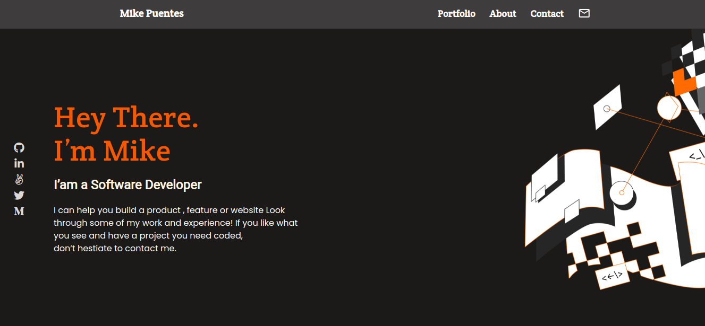

# Portfolio

>  In this project, I set up a portfolio to display some of my projects.

## Desktop 💻

## Mobile 📱

## Live Demo
https://mike2611.github.io/portfolio/
 
## Built With

- HtML, CSS, JS
- VSCode

## Install

To get a local copy up and running follow these simple example steps.
- Open terminal
- Clone this project by command git clone https://github.com/mike2611/portfolio.git
- Open index.html in the browser (you can use Live Server extension in Visual Studio Code)

## Authors

👤 **Miguel Angel Puentes**
- GitHub: [@mike2611](https://github.com/mike2611)
- Twitter: [@MiguelP2611](https://twitter.com/MiguelP2611)
- LinkedIn: [Miguel Puentes Mata](https://linkedin.com/in/miguel-puentes-mata-90a562139/)

## Contributing

Contributions, issues, and feature requests are welcome!

## Show your support

Give a ⭐️ if you like this project!
